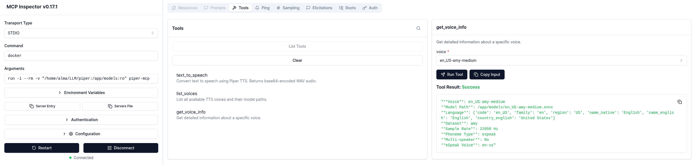

# Piper TTS API Server

A FastAPI-based HTTP server for Piper text-to-speech synthesis with MCP (Model Context Protocol) support.

## Quick Start with Docker

```bash
# Build and run with Docker Compose
git clone <your-repo>
cd piper-api
docker-compose up -d

# Test the API
curl 'http://localhost:8000/health'
curl -o test.wav -X POST 'http://localhost:8000/synthesize/ru_RU-irina-medium' \
  -H 'Content-Type: application/json' \
  -d '{"text":"Hello from Piper TTS!"}'
```

## Setup

### Prerequisites
- Python 3.13+
- eSpeak NG data (usually at `/usr/share/espeak-ng-data`)
- Piper ONNX models with corresponding JSON config files

### Installation
```bash
python -m venv .venv
source .venv/bin/activate
uv sync
```

## Configuration

Set environment variables:

```bash
# Required: Directory containing Piper models (.onnx files with corresponding .json configs)
export PIPER_MODELS_DIR="path/to/models"

# Optional: eSpeak NG data path (defaults to /usr/share/espeak-ng-data)
export ESPEAK_DATA_PATH=/usr/share/espeak-ng-data
```

The server will automatically discover all `.onnx` model files in the specified directory that have corresponding `.json` configuration files. Voice names will be derived from the model filenames (without the `.onnx` extension).

## Running

### HTTP API Server

```bash
source .venv/bin/activate
PIPER_MODELS_DIR="path/to/models" uvicorn main:app --host 127.0.0.1 --port 8000 --reload
```

### MCP Server

Run as an MCP (Model Context Protocol) server for integration with MCP-compatible clients:

#### Option 1: Local Python
```bash
source .venv/bin/activate
PIPER_MODELS_DIR="path/to/models" python run_mcp_server.py
```

#### Option 2: Docker (Recommended)
```bash
# Using the convenience script
./run_mcp_docker.sh path/to/models

# Or manually with docker
docker build -f Dockerfile.mcp -t piper-mcp .
docker run -i --rm -v "path/to/models:/app/models:ro" piper-mcp
```

The MCP server runs independently from the HTTP API and communicates via stdin/stdout. It provides the following tools:
- **text_to_speech**: Convert text to speech with full parameter control
- **list_voices**: List all available TTS voices
- **get_voice_info**: Get detailed information about a specific voice

## Docker

### Building the Docker Image

```bash
# Build the image
docker build -t piper-tts-api .

# Or with a specific tag
docker build -t piper-tts-api:latest .
```

### Running with Docker

```bash
# Run with models mounted from host directory
docker run -d \
  --name piper-tts \
  --restart unless-stopped \
  -p 8000:8000 \
  -v path/to/models:/app/models:ro \
  piper-tts-api

# Run with custom port
docker run -d \
  --name piper-tts \
  --restart unless-stopped \
  -p 3000:8000 \
  -v /path/to/your/models:/app/models:ro \
  piper-tts-api

# Run interactively for debugging
docker run -it --rm \
  -p 8000:8000 \
  -v path/to/models:/app/models:ro \
  piper-tts-api
```

### Docker Compose

Create `docker-compose.yml`:

```yaml
version: '3.8'

services:
  piper-tts:
    build: .
    ports:
      - "8000:8000"
    volumes:
      - path/to/models:/app/models:ro
    environment:
      - PIPER_MODELS_DIR=/app/models
      - ESPEAK_DATA_PATH=/usr/share/espeak-ng-data
    healthcheck:
      test: ["CMD", "curl", "-f", "http://localhost:8000/health"]
      interval: 30s
      timeout: 10s
      retries: 3
      start_period: 40s
    restart: unless-stopped
```

Run with Docker Compose:

```bash
# Start the service
docker-compose up -d

# View logs
docker-compose logs -f

# Stop the service
docker-compose down
```

### Docker Usage Notes

**Volume Mounting**: The models directory must be mounted as a volume since the Docker image doesn't include the large model files. Mount your models directory to `/app/models` in the container.

**Health Check**: The container includes a health check that verifies the API is responding. You can check the health status with:

```bash
# Check container health
docker ps

# View health check logs
docker inspect --format='{{json .State.Health}}' piper-tts
```

**Logs**: View application logs:

```bash
# Docker run logs
docker logs piper-tts

# Docker compose logs
docker-compose logs -f piper-tts
```

**Troubleshooting**:
- Ensure your models directory contains `.onnx` files with corresponding `.json` configs
- Check that the mounted volume path is correct
- Verify port 8000 is not already in use on the host
- For permission issues, ensure the models directory is readable by the container

## API Endpoints

### Health Check
```bash
GET /health
```
Returns server status and available voices.

### List Voices
```bash
GET /voices
```
Returns mapping of voice names to model paths.

### Synthesize Speech
```bash
POST /synthesize/{voice_name}
Content-Type: application/json

{
  "text": "Text to synthesize",
  "speaker": 0,                  // optional, multi-speaker model index
  "noise_scale": 0.667,          // optional, generator noise (default 0.667)
  "length_scale": 1.0,           // optional, phoneme length (default 1.0)
  "noise_w": 0.8,                // optional, phoneme width noise (default 0.8)
  "sentence_silence": 0.2,       // optional, silence after sentences (default 0.2)
  "rate": 1.0,                   // optional, convenience for speed (1.05=faster, 0.95=slower)
  "volume": 1.0                  // optional, post-synthesis volume multiplier
}
```

The voice name is specified in the URL path. If the voice is not found, returns 404.

Returns WAV audio file.

## Examples

```bash
# Basic synthesis with ru_RU-irina-medium voice
curl -o output.wav -X POST 'http://127.0.0.1:8000/synthesize/ru_RU-irina-medium' \
  -H 'Content-Type: application/json' \
  -d '{"text":"Привет! Это проверка синтеза."}'

# With speed and volume adjustment using ru_RU-dmitri-medium voice
curl -o output.wav -X POST 'http://127.0.0.1:8000/synthesize/ru_RU-dmitri-medium' \
  -H 'Content-Type: application/json' \
  -d '{"text":"Быстрая и громкая речь","rate":1.2,"volume":1.1}'

# Test with non-existent voice (returns 404)
curl -X POST 'http://127.0.0.1:8000/synthesize/non-existent-voice' \
  -H 'Content-Type: application/json' \
  -d '{"text":"This will fail"}'
```

## MCP (Model Context Protocol) Integration

The Piper TTS service includes a separate MCP server implementation (`run_mcp_server.py`) that runs independently from the HTTP API, allowing integration with MCP-compatible clients like Claude Desktop, IDEs, and other AI tools.

### MCP Server Configuration

To use the Piper TTS service as an MCP server, add it to your MCP client configuration:

**For Claude Desktop** (`~/Library/Application Support/Claude/claude_desktop_config.json` on macOS):

#### Local Python Configuration:
```json
{
  "mcpServers": {
    "piper-tts": {
      "command": "python",
      "args": ["/path/to/piper-api/run_mcp_server.py"],
      "env": {
        "PIPER_MODELS_DIR": "path/to/models",
        "ESPEAK_DATA_PATH": "/usr/share/espeak-ng-data"
      }
    }
  }
}
```

#### Docker Configuration:
```json
{
  "mcpServers": {
    "piper-tts": {
      "command": "docker",
      "args": [
        "run", "-i", "--rm",
        "-v", "/absolute/path/to/models:/app/models:ro",
        "piper-mcp"
      ]
    }
  }
}
```

**For MCP Inspector**, use these settings:
- **Transport Type**: STDIO  
- **Command**: `docker`
- **Arguments**: `run -i --rm -v "/home/alma/LLM/piper:/app/models:ro" piper-mcp`

**Run inspector**
```bash
npx @modelcontextprotocol/inspector
```



### MCP Tools Available

When running as an MCP server, the following tools are available:

#### 1. text_to_speech
Convert text to speech and return base64-encoded WAV audio.

**Parameters:**
- `text` (required): Text to convert to speech
- `voice` (required): Voice name to use
- `speaker` (optional): Multi-speaker index
- `rate` (optional): Speech rate multiplier (1.05 = faster, 0.95 = slower)
- `volume` (optional): Volume multiplier (1.2 = +20% louder)
- `noise_scale` (optional): Generator noise scale
- `length_scale` (optional): Phoneme length scale
- `noise_w` (optional): Phoneme width noise
- `sentence_silence` (optional): Silence after sentences

#### 2. list_voices
List all available TTS voices with their model information.

**Parameters:** None

#### 3. get_voice_info
Get detailed information about a specific voice including language, dataset, sample rate, and multi-speaker capabilities.

**Parameters:**
- `voice` (required): Voice name to get information about

### Running Both Services

You can run both the HTTP API and MCP server simultaneously since they operate independently:

```bash
# Terminal 1: Start HTTP API server
source .venv/bin/activate
PIPER_MODELS_DIR="path/to/models" uvicorn main:app --host 127.0.0.1 --port 8000

# Terminal 2: Start MCP server (choose one option)
# Option A: Local Python
source .venv/bin/activate
PIPER_MODELS_DIR="path/to/models" python run_mcp_server.py

# Option B: Docker (recommended)
./run_mcp_docker.sh path/to/models
```

### MCP Usage Examples

Once configured with an MCP client, you can use natural language to interact with the TTS service:

- "Convert this text to speech using the Russian voice"
- "List all available TTS voices"
- "Get information about the dmitri voice"
- "Generate speech for this paragraph with a faster rate"

The MCP server will handle the tool calls and return audio as base64-encoded data that can be decoded and played by the client.